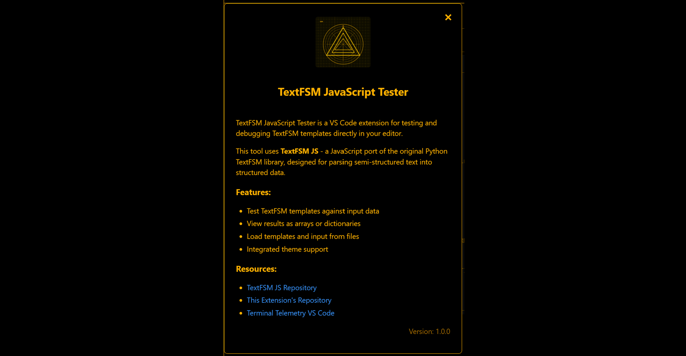

# TextFSM Tester for VS Code

<div align="center">
  
</div>

A Visual Studio Code extension for testing and debugging TextFSM templates directly in your editor.

## Features

- Test TextFSM templates against input data in real-time
- View parsing results as arrays or dictionaries
- Load templates and input from files
- Open files directly as templates or input text
- Integrated theme support that adapts to your VS Code preferences

## Screenshot

<div align="center">
  
</div>
## Installation

You can install this extension in several ways:

1. **VS Code Marketplace**: Search for "TextFSM Tester" in the Extensions view
2. **Direct Install**: Download the VSIX file from the [releases page](https://github.com/scottpeterman/tfsmjstester/releases) and install it using "Install from VSIX..."
3. **Command Line**: Run `code --install-extension textfsm-tester-0.1.0.vsix`

## Usage

1. Open the extension using one of these methods:
   - Click the "Developer Tools" icon in the activity bar and select "TextFSM Tester"
   - Use the Command Palette (Ctrl+Shift+P) and search for "Open TextFSM Tester"
   - Right-click on a file and select "Open in TextFSM Tester as Template" or "Open in TextFSM Tester as Input"

2. Enter your TextFSM template in the Template area
3. Enter the text to parse in the Input Text area
4. Click "Parse Text" to see the results
5. Click "Parse to Dictionary" to see results in dictionary format

## TextFSM Template Example

```
Value Interface (\S+/\d)
Value Status (up|down)
Value Protocol (up|down)

Start
  ^${Interface}\s+${Status}\s+${Protocol} -> Record
```

## Input Text Example

```
Interface    Status    Protocol
Gig0/1       up        up
Gig0/2       down      down
Gig0/3       up        up
```

## Requirements

* Visual Studio Code 1.60.0 or newer

## Extension Settings

This extension does not add any VS Code settings yet.

## Known Issues

* None reported yet. Please submit issues on GitHub.

## Release Notes

### 0.1.0

- Initial release
- Basic TextFSM template testing
- Dictionary output support
- File loading capabilities
- Theme integration

## About TextFSM

TextFSM is a template-based state machine for parsing semi-formatted text. Originally developed by Google, it is particularly useful for parsing the output of network devices.

This extension uses a JavaScript port of the original TextFSM library.

## Contributing

Contributions are welcome! Please feel free to submit a Pull Request.

## License

This project is licensed under the MIT License - see the LICENSE file for details.